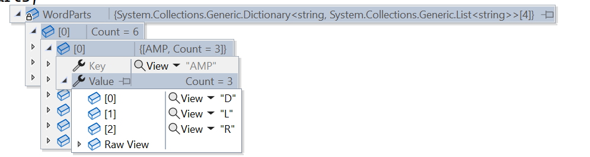
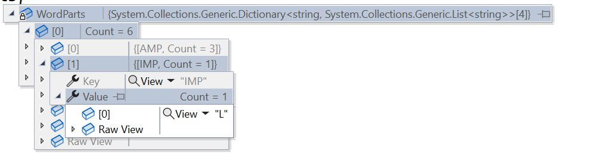
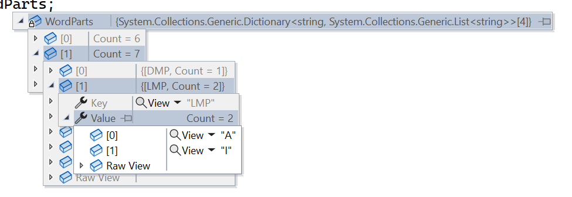
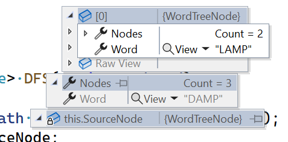

<!--Category:C#,SQL--> 
 <p align="right">
    <a href="http://productivitytools.tech/productivitytools-createsqlserverdatabase/"><a> 
    <a href="https://github.com/ProductivityTools-Learning/ProductivityTools.Example.GCP.SecretManager"></a>
</p>
<p align="center">
    <a href="http://http://productivitytools.tech/">
        
    </a>
</p>


# Quests

Repository is used to store different coding quests

<!--more-->

## WordDistance

```
//Cracking the code interview 
/**
 * You have a large text file containing words. Given any two words,
 * find the shortest distance (in terms of number of words) between
 * them in the file. If the operation will be repeated many times
 * for the same file (but different pairs of words), can you
 * optimize your solution?
 */
```

- Brute force solution is to iterate through the words and look for the shortest distance it is ok solution for invoking one
- For invoking several times: create a dictionary from words to have positions to the locations of the words. For this dictionary also two solutions
  -  Use additional structure in which we will again order words and then calculate distance between two neightbors - easier to debug, more time and space complex
  - Calcualte distance on the fly - optimum solution


## Word ladder

### Quest
[source](https://leetcode.com/problems/word-ladder/)

  ```
  Given a dictionary containing a list of words, a starting word, and an ending word, return the minimum number of steps to transform the starting word into the ending word.

A step involves changing one letter at a time to a valid word that is present in the dictionary.

Return null if it is impossible to transform the starting word into the ending word using the dictionary.

Example:

transformWord(‘DAMP’, ‘LIKE’)
Output: DAMP->LAMP->LIMP->LIME->LIKE
```
### Solution

- Filter all words in the dictionary to filter words with given amount of letters

If we are looking for 4 letters word Dictionary[6] will be removed
```C#
Dictionary[0] = "DAMP";
Dictionary[1] = "LAMP";
Dictionary[2] = "LIMP";
Dictionary[3] = "LIME";
Dictionary[4] = "LIKE";
Dictionary[5] = "LALA";
Dictionary[6] = "WUJCZYK";
Dictionary[7] = "RAMP";
Dictionary[8] = "DAMD";
```

- Create array of dictionaries where 
  - key -  will be with n-1 (in our example 3) part of the words
  - value - will contain letters which when inserted into particular place will create a word

Example:
Id of the dictionary informs us about the place where we should insert letter.
Below example show us **AMP**. on the 0 index we have array of 3 letters which creates different word from our dictionary



On the 0 index we also have other words. Below example of **IMP**



On the second position of 4 letter word we have the same situation




- build a tree
  - take the first word which was given as argument and take all combinations of substrings DAMP (AMP,DMP,AMP) - it will be looked in  in previously defined dictionaries


- use DFS or BFS to find path
- print path


  
