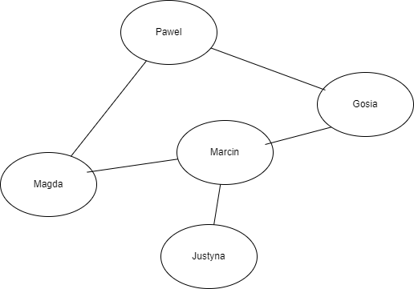
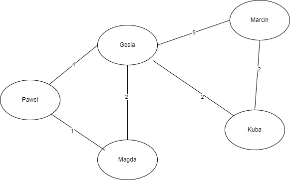

<!--Category:C#,SQL--> 
 <p align="right">
    <a href="http://productivitytools.tech/productivitytools-createsqlserverdatabase/"><a> 
    <a href="https://github.com/ProductivityTools-Learning/ProductivityTools.Example.GCP.SecretManager"></a>
</p>
<p align="center">
    <a href="http://http://productivitytools.tech/">
        
    </a>
</p>


# Quests


Repository is used to store different coding quest.
[Draw.io file](https://app.diagrams.net/#G1z-c3mN3V7xB3Kej71jyUp6bZdj1GPvhg)

<!--more-->

## Cracking the code interview

### Array and strings(83,181)

 **Implement an algorithm to detrime if a string has all unique characters. What if you cannot use additional data structures** 

- If string lenght is more than letters in alphabet => false
- If we can use additional structure then iteration and hashset with seen letters - Time complexity: O(n) iteration+ n*O(1) Hashset=O(2n)
- We can improve the hashset by creating array with all the characters in advance and null them when found in string
- We can also sort the array and check if we have two letters the same next to each other O(n log(n))


 **Implement a function which reverses a null terminated string**

- cat => tac
- Create an additional array and rewrite string
- while loop, with two pointers
- for loop with one going from start and second string.lenght-1-firstIterator

  **Given two strings write a method to decide if one is a permutation of the other**
 - what is permutation? = all words creatd from given set of letters is permutation
 - check the lenght
 - sort and compare the elements
 - check if in the second word we have all leters as in the first one
 - check if strings have the same character count 
 - if this case sensitive 
 - if we trim the sapces 

  **Write a method to replace all spaces in string with '%20' you may assume that the string has sufficient space at the end of the string. Please do it in place**

- If we won't do it in place it is simple we create the second array and copy 
- Other way we need to start from the end

 **Implement a method to perform basic string compression using the counts of repated characters. aabcccccaa would become a2b1c5a3. If the 'compressed string would not become smaller than the original string your method should return the original string**

- the compression makes only sense if we have more doubled letters than single ones, we could check it in advance
- simple while
- use string buffer 
- as string concatention is expensive and we do not want to use string buffer we need to count size of the target string 

 **Given an image represented by NxN matrix write where each pixel in the image is 4 butes write a method to rotate the image by 90 degress. Can you do this in place?**

- int[,] a = new int[4,4]
```
R,C=>R,C
0,0=>0,3
0,1=>1,3
0,2=>2,3
0,3=>3,3
```

```
R,C=>R,C
0,0=>0,3
1,0=>0,2
2,0=>0,1
3,0=>0,0
```

```C#
int dimension=a.GetLength(0);//3
for(int row=0;row<a.GetLength(0);row++)
{
    for(int column=0;column<a.GetLegth(1);column++>)
    {
      b[column,dimension-row]=a[row,column]
    }
}
```

- multiple layers not only first row 
- not sure if I want to analyze it

  **Write an althoritm such that if an element in an MxN matrix is 0 its entire row and column are set to 0**
- The matrix is done, so we need to look at the matrix and change it, everytime when we see the 0 we should set whole row and column to 0
- The difficult part is when we will setup first time the row and column then we are loosing some information (we do not know if we covered some 0)
- We could iterate table and save in two arrays rows and columns to zero


 **Assume you have a method isSubstring which checks if one word is a substring of another Given two strings S1 and S2 Write code to check if S2 is a rotation of S1 using only one call to is substring**

- What is a rotation, we can move a part of the sentence to the end like=>ikel or =>keli
- We can sort the string and call the method, but this could give us false positives  
- better is join twice the word so kelikeli for sure has like inside

### LinkedLists (86,192)

 **Write code to remove duplicates from an unsorted linked list. How would you solve this problem if a temporary buffer is not allowed?**
- create a hashset with all met values
- sort list (with quick sort version)

**Implement an alghorithm to find the kth to last element of the singly linked list.**
-  If the list link size is known we can just iterate to the lenght - k element
- two pointers one which will be k elements behind the first one
-  we need two pointers one which points to the current element and second which validates other nodes
-  Recursive algorithm recurses throught he list. When it hits the end the method basses back a counter set to 0. EAch parent call adds 1 to this counter. Problem here is how to return the node, we can print it or pass by the reference

  **Implement an alghoritm to delete a node in the middle onf the singly linked list given only acces to that node. Example Input: the node C from the linked list a->b->c->d->e**

**Result: nothing is returned but the new linked list looks like a->b->d->e**
- we need to rewrite all values from the next node to the current one and remove the pointer to the next one

  **Write a code to partition a linked list around a value x such that all nodes less than  x come before all nodes greated than equal to x**
- Create two lists and merge as the last step

**You have two number represented by a linked list where ach node contains a single digit. The digits are sorted in reverse order such taht 1's digit is at the head of the list. Write a function that addes the two numbers and returns the sum of as a linked list** CODE

**Example:
Input (7->1->6)+(5->9->2) that is 617 +295 
Output (2->1->9) That is 912**

**Follow-up suppose the digits are stored in forward order**

**Given a circular linked list, implement an alghorithm which returns the node at the beginning of the loop**
- We can save reference to each node in hashset to validate if we had already one item
- We can go with two pinters, one which points current element and second which id going to the end of the list validating if they will meet again
- To detect the loop we can use fast runner slow runner, they should meet eventualy
- Not doing it too complex.

**Implement a function to check if a linked list is a palindrome**
- Palidrome so the numbers are the same forward and backwards - 12321
- Is the list one way linked?
- If we know the size we can reverse half of the list and compare
- We can push all the items on the stack and take them , but then we will need to know what is the size


## WordDistance

```
//Cracking the code interview 
/**
 * You have a large text file containing words. Given any two words,
 * find the shortest distance (in terms of number of words) between
 * them in the file. If the operation will be repeated many times
 * for the same file (but different pairs of words), can you
 * optimize your solution?
 */
```

- Brute force solution is to iterate through the words and look for the shortest distance it is ok solution for invoking one
- For invoking several times: create a dictionary from words to have positions to the locations of the words. For this dictionary also two solutions
  -  Use additional structure in which we will again order words and then calculate distance between two neightbors - easier to debug, more time and space complex
  - Calcualte distance on the fly - optimum solution


## Word ladder

### Quest
[source](https://leetcode.com/problems/word-ladder/)

  ```
  Given a dictionary containing a list of words, a starting word, and an ending word, return the minimum number of steps to transform the starting word into the ending word.

A step involves changing one letter at a time to a valid word that is present in the dictionary.

Return null if it is impossible to transform the starting word into the ending word using the dictionary.

Example:

transformWord(‘DAMP’, ‘LIKE’)
Output: DAMP->LAMP->LIMP->LIME->LIKE
```
### Solution

- Filter all words in the dictionary to filter words with given amount of letters

If we are looking for 4 letters word Dictionary[6] will be removed
```C#
Dictionary[0] = "DAMP";
Dictionary[1] = "LAMP";
Dictionary[2] = "LIMP";
Dictionary[3] = "LIME";
Dictionary[4] = "LIKE";
Dictionary[5] = "LALA";
Dictionary[6] = "WUJCZYK";
Dictionary[7] = "RAMP";
Dictionary[8] = "DAMD";
```

- Create array of dictionaries where 
  - key -  will be with n-1 (in our example 3) part of the words
  - value - will contain letters which when inserted into particular place will create a word

Example:
Id of the dictionary informs us about the place where we should insert letter.
Below example show us **AMP**. on the 0 index we have array of 3 letters which creates different word from our dictionary


On the 0 index we also have other words. Below example of **IMP**


On the second position of 4 letter word we have the same situation


- build a tree
  - take the first word which was given as argument and take all combinations of substrings DAMP (AMP,DMP,AMP) - it will be looked in  in previously defined dictionaries


- use DFS or BFS to find path
- print path


## BFS
It shows how to do BFS with the undirected graph. Objects could have connections beteen each over A has reference to B, and B has reference to A. Connections are not weighted.

BFS cannot be used to find the shortest path. Dijkstra's algorithm adapts BFS to let you find single-source shortest paths.

To print the path from one node to the node which we had been looking for, we need to save reference to parent.

BFS we are usually doing with the Queue and the while. We are adding all nodes on given level to the queue and while queue is not empty we are processing elements




## DFS

- **Important** difficult part is returning value and poping in right place

```c#
Visited.Add(node);
Path.Push(node);
if (node.Name == lookUpValue)
{
    return node;
}
else
{
    foreach (var childNode in node.Nodes)
    {
        if (Visited.Contains(childNode) == false)
        {
            var result=Search(childNode, lookUpValue);
            if (result == null)
            {
                Path.Pop();
            }
        }
    }
    return null;
}
```

### BFS vs DFS
||BFS|DFS|
|--|---|---|
|Working object|Node contains node|Node contains node|
|Working function|NodeQueue|Recursion|
|Path object|ChildParentDictionary|Stack

## Dijkstra

- We need to have nodes and the edges. Edge needs to contain From and To Node reference
- Weights cannot be negative



## MST Prim

- Do it also with the array instead of names
- Performed for the same graph as Djkstra

### Comparing Prim’s and Dijkstra’s Algorithms
In the computation aspect, Prim’s and Dijkstra’s algorithms have three main differences:

- Dijkstra’s algorithm finds the shortest path, but Prim’s algorithm finds the MST
- Dijkstra’s algorithm can work on both directed and undirected graphs, but Prim’s algorithm only works on undirected graphs
- Prim’s algorithm can handle negative edge weights, but Dijkstra’s algorithm may fail to accurately compute distances if at least one negative edge weight exists

In practice, Dijkstra’s algorithm is used when we want to save time and fuel traveling from one point to another. Prim’s algorithm, on the other hand, is used when we want to minimize material costs in constructing roads that connect multiple points to each other.

|Dijkstra|Prim|Kruskal|
|---|---|---|
|EdgePriorityQueue|EdgePriorityQuene|EdgePriorityQuene|
|NodesVisitedHashset|NodesVistedHashset|QuickUnion<Node>|
|DistanceToDictionary|EdgeMSTList|MST| 